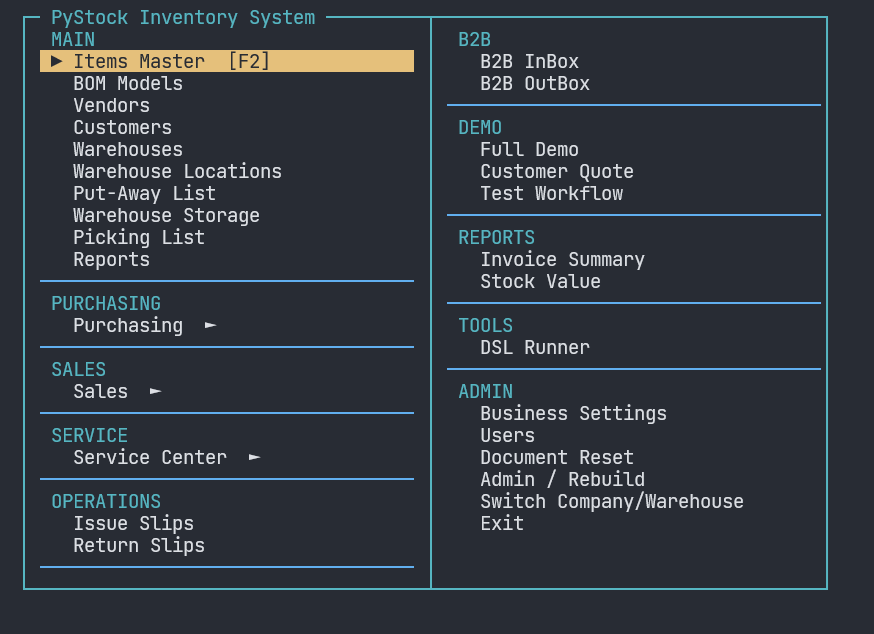
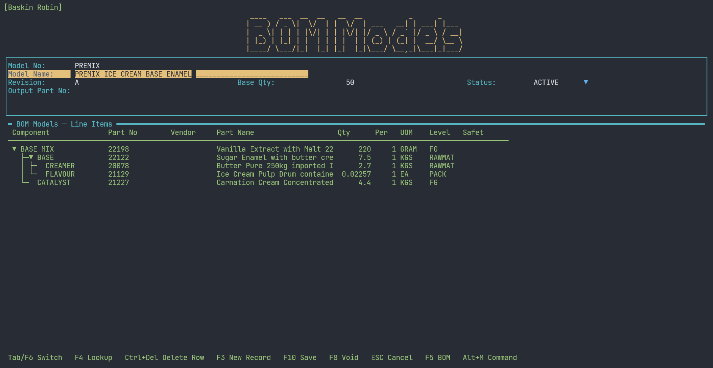
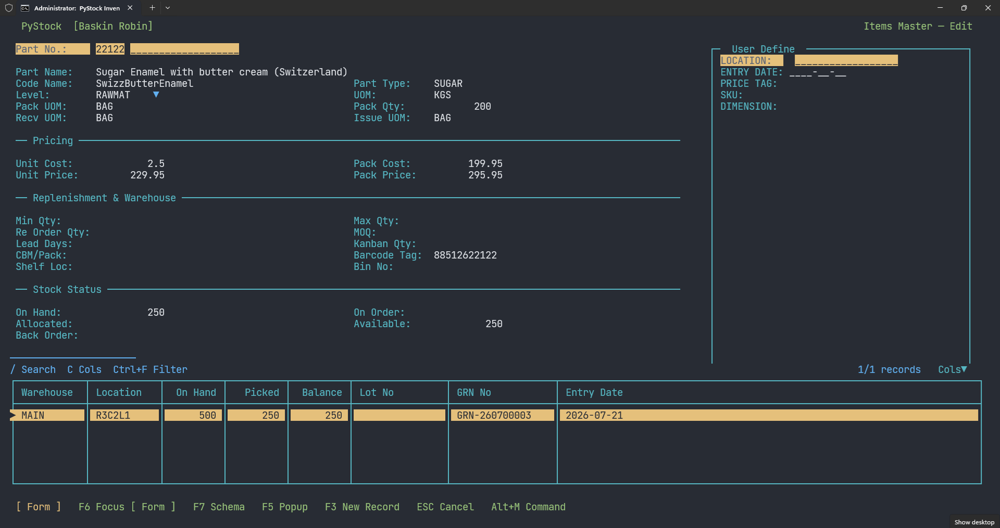
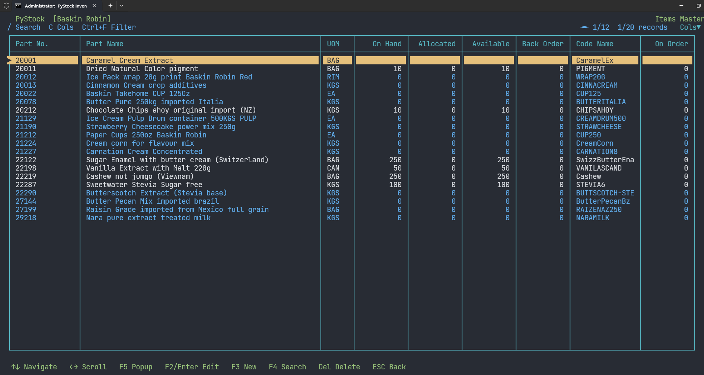

# dbnocode — Build full business apps without writing code

dbnocode is a **no-code application platform** that turns a short text script
into a complete, production-style business application — data entry forms,
browse grids, menus, workflows, reports and an inventory engine — with zero
application code.

Describe your screens in a `.dsl` script, run it, and dbnocode validates,
parses and renders a full terminal (TUI) application bound to your database.
No Python modules to write. No web stack to deploy. **Edit a text file and
re-run — that's the entire development loop.**

```text
FORM customer TITLE "Customers" COLS 2
  name | 40 | req span:2
  kind | 12 | opts:Retail,Wholesale
  LIST name:30 kind:12
END
```

That is a complete app: a customer table, an entry form, and a browsable list.

## Screenshots






## Why dbnocode

- **Go from idea to working app in minutes** — screens, actions and menu wiring
  are auto-generated from your form declarations.
- **Runs anywhere** — a fast, keyboard-driven terminal UI that runs on a stock
  terminal with no browser, no server, and no runtime install needed.
- **Zero-config database** — SQLite by default; the database file is created
  on first run. PostgreSQL, Firebird and libSQL/sqld are one-line changes.
- **Ship as a single EXE** — one build script produces a distributable runtime
  and a project initializer your end users can run without Python.
- **Built for real business workflows** — document headers with detail grids,
  automatic postings, stock movements, multi-level user permissions, and
  PDF reports.

## What you can build

| Capability | What it gives you |
|---|---|
| **Forms & grids** | Multi-column entry forms, sections, child detail grids, lookups, dropdowns, computed fields, auto-number prefixes |
| **Inventory engine** | RECEIVE / ISSUE / ALLOCATE / TRANSFER with lot tracking, pack-unit conversion, and stock-card postings in one transaction |
| **Postings & workflows** | `ON SAVE` auto-posting, draft→posted→void status flows, and a small safe scripting language |
| **Reports** | Listing, summary and crosstab reports with totals, live filter prompts, and PDF export |
| **Users & permissions** | Login context with numeric levels and field-level lockout that fails safe to read-only |
| **Menus & navigation** | Pulldown top-bar menus or a center launcher, hotkeys, module `INCLUDE`s |
| **Multi-user backends** | Optional shared server for PostgreSQL / Firebird / libSQL — run with a local file, or go remote |

## Author with AI

You don't have to write a DSL script by hand. Hand an AI assistant the three
reference documents, describe the application you need, and let it write
the `.dsl` file for you.

**Auto Repair Shops, an ERP, Accounting, Point-of-Sale, Inventory** — whatever
you describe, the AI generates a validated, runnable script. Edit the text file
line by line any time to tweak it; every screen you see is defined in plain text.

1. Give your AI assistant these three files:
   - `docs/dsl_tutorial.md` — how to build forms, details, stock, reports, menus
   - `docs/canonical_dsl.md` — the canonical DSL reference
   - `docs/grammar.ebnf` — the formal grammar
   - (optional) any sample script under `scripts/` as a style reference
2. Paste this prompt and describe your app:

   ```text
   You are authoring a dbnocode DSL application.
   Read docs/dsl_tutorial.md, docs/canonical_dsl.md and docs/grammar.ebnf.

   Build an application for: {describe your app — e.g. an auto repair shop
   with work orders, customer vehicles, parts stock and a job pricing report}

   Rules:
   - Write the complete script to scripts/my_app.dsl using the compact DSL only
   - Include a MENU and one or more FORMs with LISTs; add DETAIL, STOCK
     operations and REPORTs where the app needs them
   - Use only documented field flags: req, num, date, ro, upper, prefix,
     span, rows, default, opts, lookup, fill, filter, formula
   - Match the style of the sample scripts and do not modify Python files
   - Validate the result with:  python main.py --validate-only scripts/my_app.dsl
   ```

3. Run the generated app:

   ```bash
   python main.py --validate-only scripts/my_app.dsl   # check it first
   python main.py scripts/my_app.dsl                   # or just run it
   ```

A minimal sample app is included in `scripts/01_main_menu_compact.dsl` — the
simplest starting point to copy, modify, or show your AI assistant as an
example target.

## Quick start

```bash
pip install -r requirements.txt

# Run the bundled ERP demo app
python main.py

# Run a specific script
python main.py scripts/04_inventory_compact.dsl

# Validate a script without launching the UI
python main.py --validate-only scripts/04_inventory_compact.dsl

# Turn an Excel workbook into a CRUD app and preload its SQLite data
python main.py --import-excel inventory.xlsx
python main.py scripts/inventory.dsl
```

Excel import accepts `.xlsx` and `.xlsm`. Each detected worksheet table becomes a
compact `FORM` declaration in the same classic layout as hand-authored forms: the
**List** is searchable and supports Enter/F3/Ctrl+D, and each row opens into the
normal F10 CRUD editor. The generated `.dsl` is written under `scripts/` and its
database is written in the current directory. Use `--output path.dsl` or
`--database path.db` to choose other destinations; existing output is protected
unless `--force` is supplied.

The importer recognizes conventional header rows, infers text/number/date
fields from cell values and formats, preserves up to 5,000 rows per sheet, and
also recognizes NocodeXL-style blue input and yellow display cells. If a styled
header and a line-item table share a sheet, both are preserved as CRUD forms.
Every worksheet column becomes a grid column (scroll horizontally to reach them
all), and non-Latin headers keep their native script (Thai, CJK, Arabic).

`Import Excel` is also added automatically to the main menu's **System**
section. Enter or paste the workbook path in the dialog. When the app is running
from a DSL script with a reachable database, the import registers the generated
forms beside that script (`<script>.imports/` + `<script>.imports.json`) and
seeds the workbook rows into the app's own database — the forms appear under an
**Imported Excel** menu section on the next launch, part of the same app. If no
host script or database is available it falls back to a standalone project and
shows the command for opening it. Re-importing a workbook whose forms already
exist asks whether to replace them or stop before anything is overwritten.
**Delete Imported Excel** (main menu → **System**) lists every registered import
and lets you remove one: it unregisters the sidecar, deletes the file, and drops
that import's data tables.

By default the app uses a local SQLite file — fully standalone, no server
required. A remote/shared backend is optional (`server.py` / `FBServer.py`).

## Choose your database

One line in your script switches backends:

```text
DATASOURCE "myapp_db" ADAPTER "sqlite"      # zero setup, local file
DATASOURCE "myapp_db" ADAPTER "postgres"    # PostgreSQL
DATASOURCE "myapp_db" ADAPTER "firebird"    # Firebird
```

## Distribute to end users

`build_all.bat` produces ready-to-run EXEs:

- `dsl_tui_app.exe` — the runtime (bundles engine + scripts, no Python needed)
- `dbnocode_init.exe` — project initializer your end users can run
- `dbnocode-server.exe` / `dbnocode-fbserver.exe` — optional shared backends

## Learning & reference

- **[`docs/dsl_tutorial.md`](docs/dsl_tutorial.md)** — step-by-step tutorial:
  forms, fields, details, scripts, stock, menus, reports, users.
- **[`docs/canonical_dsl.md`](docs/canonical_dsl.md)** — the canonical DSL reference.
- **[`docs/grammar.ebnf`](docs/grammar.ebnf)** — formal grammar.
- **[`docs/tutorial.txt`](docs/tutorial.txt)** — long-form worked tutorial.
- **[`REVIEW.md`](REVIEW.md)** — architecture notes, known limitations and the
  remediation roadmap.

## Project layout

| Path | Purpose |
|------|---------|
| `main.py` | Entry point: include resolution → validate → parse → run |
| `dsl_lib/` | Validator, parsers, runner, script engine, DB adapters, report engine |
| `tui/` | Terminal widgets: grids, layout, menus, themes, reports |
| `scripts/` | Example DSL apps, from a menu-only starter to a full ERP |
| `docs/` | DSL reference and tutorials |
| `init_app.py` | Scaffolds a new project folder (TUI + GUI wizards) |

## Notes

- Run your terminal in a UTF-8 locale so box-drawing glyphs render correctly.
- The core loop is *edit the script, rerun* — see `REVIEW.md` for known
  limitations and the roadmap.
